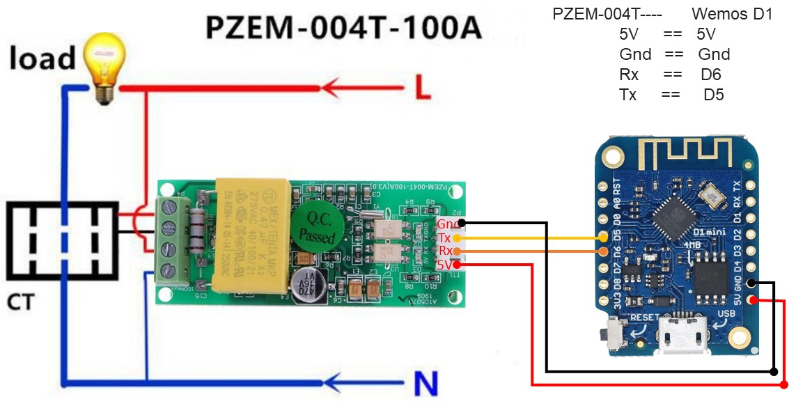
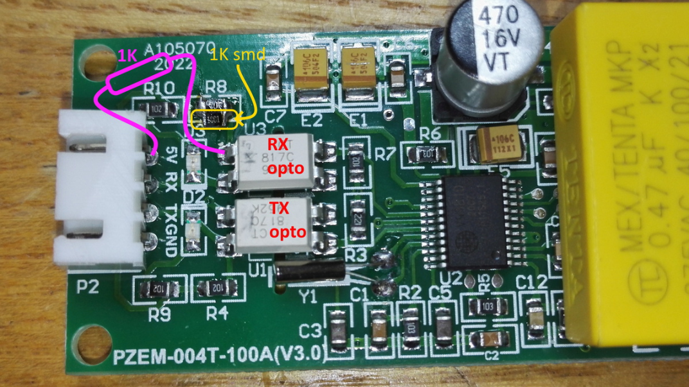
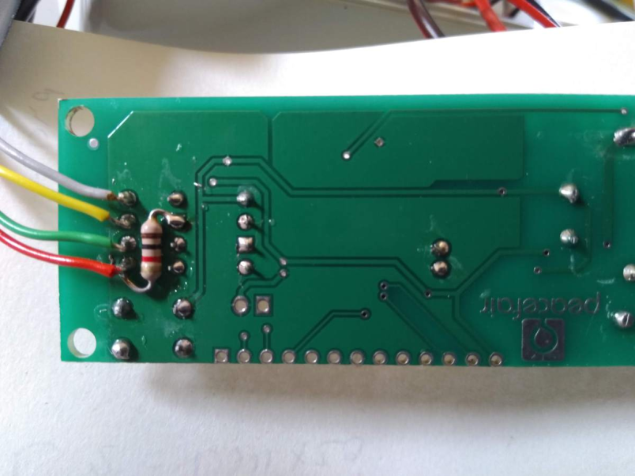
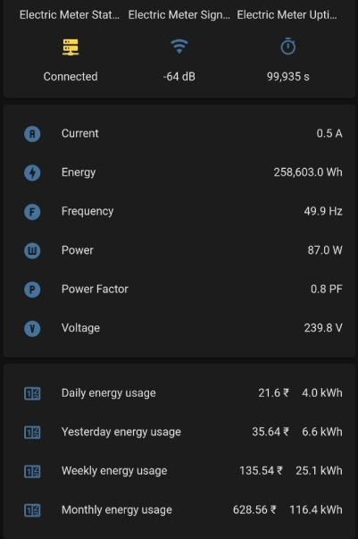

# PZEM-004T Based Energy Monitoring

Why: PZEM-004T is a factory calibrated energy monitor system, which can monitor and report up to 100A AC, through non-intrusive method. While there are debates over the accuracy of this system, it is sufficient to monitor home energy consumption, and returns good values. 

## PZEM-004T Sensor purchase link:

- Robu: https://robu.in/product/pzem-004t-multi-function-ac-power-monitor-module/
- Techtonics: https://www.techtonics.in/peacefair-pzem-004t-ac-multi-function-electric-energy-metering-power-monitor
- ESPHome Doc: https://esphome.io/components/sensor/pzemac.html

If possible buy one with clamp instead of solid/ring core so can be de-attached easily without removing wires, althugh finding one with the clamp has now become extremely difficult. Ring does the job well.

## How?

To use sensor with ESP you'll have to add 1K resistor. PZEM is designed to work with 5V and for driving RX we have to reduce that, as ESP chips can only handle 3.3V safely on its GPIOs.

Refer here for more details: https://tasmota.github.io/docs/PZEM-0XX/

Connect the sensor to the ESP Board:

```
ESP 5V   <-->  PZEM 5V
ESP GND  <-->  PZEM GND
ESP RX   <-->  PZEM TX
ESP TX   <-->  PZEM RX
```







Note: Once you apply the resistor mode, there is a high likely chance that PZEM would not work when powered from 5V. In such instances, you may try powering the PZEM sensor from the ESP 3.3V. It should work. 

## Troubleshooting

- If the device is not functioning as expected, double check, and triple check wiring. Ensure continuity using a Digital Multimeter.
- Ensure AC is connected as per the figure mentioned here.
- Double check 3.3V/5V power as mentioned above.

## Code

pzem-esphome.yaml

```yaml
esphome:
  name: electric_meter
  platform: ESP8266
  board: d1_mini

wifi:
  ssid: "ssid"
  password: "password"
  ap:
    ssid: "Electric Meter Fallback Hotspot"
    password: "OxsiMNOAfHJl"

#logger:
# Logging disabled since the PZEM should ideally be connected to the UART pins, and D1 Mini has only one UART interface. 
captive_portal:
web_server:
api:
ota:

time:
  - platform: sntp
    id: my_time
    servers:
      - 192.168.1.1

uart:
  rx_pin: 12
  tx_pin: 14
  baud_rate: 9600

binary_sensor:
  - platform: status
    name: "Electric Meter Status"

sensor:
  - platform: wifi_signal
    name: "Electric Meter Signal"
    update_interval: 30s
  - platform: uptime
    name: Electric Meter Uptime    

#FAST SENSORS FOR ENERGY CALCULATION & LOCAL DISPLAY
  - platform: pzemac
    current:
      name: "PZEM-016 Current"
      id: aac
      internal: true
    voltage:
      name: "PZEM-016 Voltage"
      id: vac
      internal: true
    energy:
      name: "PZEM-016 Energy"
      id: eac
      internal: true
    power:
      name: "PZEM-016 Power"
      id: w
      internal: true
    frequency:
      name: "PZEM-016 Frequency"
      id: f
      internal: true
    power_factor:
      name: "PZEM-016 Power Factor"
      id: pf
      internal: true
    update_interval: 2s

  - platform: total_daily_energy
    name: "Energy kwh"
    power_id: w
    filters:
        # Multiplication factor from W to kW is 0.001
      - multiply: 0.001
    unit_of_measurement: kWh
    icon: mdi:counter
    accuracy_decimals: 1

#SLOW SENSORS FOR HOME ASSISTANT
  - platform: template #########################
    name: "Current"
    lambda: |-
      if (id(aac).state) {
        return (id(aac).state);
      } else {
        return 0;
      }
    unit_of_measurement: A
    icon: "mdi:alpha-a-circle"
    update_interval: 10s

  - platform: template #########################
    name: "Voltage"
    lambda: |-
      if (id(vac).state) {
        return (id(vac).state);
      } else {
        return 0;
      }
    unit_of_measurement: V
    icon: "mdi:alpha-v-circle"
    update_interval: 10s

  - platform: template #########################
    name: "Energy"
    lambda: |-
      if (id(eac).state) {
        return (id(eac).state);
      } else {
        return 0;
      }
    unit_of_measurement: Wh
    icon: "mdi:flash-circle"
    update_interval: 10s

  - platform: template #########################
    name: "Power"
    lambda: |-
      if (id(w).state) {
        return (id(w).state);
      } else {
        return 0;
      }
    unit_of_measurement: W 
    icon: "mdi:alpha-w-circle"
    update_interval: 10s

  - platform: template #########################
    name: "Frequency"
    lambda: |-
      if (id(f).state) {
        return (id(f).state);
      } else {
        return 0;
      }
    unit_of_measurement: Hz
    icon: "mdi:alpha-f-circle"
    update_interval: 10s

  - platform: template #########################
    name: "Power Factor"
    lambda: |-
      if (id(pf).state) {
        return (id(pf).state);
      } else {
        return 0;
      }
    unit_of_measurement: PF
    icon: "mdi:alpha-p-circle"
    update_interval: 10s
```

If you would like to add pricing based on template in Home Assistant, use the following configuration.

```yaml
sensor:
  - platform: template
    sensors:
      yesterday_energy:
        value_template: "{{ state_attr('sensor.daily_energy', 'last_period') }}"
        icon_template: mdi:counter
      last_month_energy:
        value_template: "{{ state_attr('sensor.monthly_energy', 'last_period') }}"
        icon_template: mdi:counter
      energy_cost_daily:
        friendly_name: "Cost Daily"
        unit_of_measurement: '₹'
        icon_template: mdi:currency-inr
        value_template: "{{ (states('sensor.daily_energy') | float * 5.40) | round(2) }}"
      energy_cost_yesterday:
        friendly_name: "Cost Yesterday"
        unit_of_measurement: '₹'
        icon_template: mdi:currency-inr
        value_template: "{{ (states('sensor.yesterday_energy') | float * 5.40) | round(2) }}"
      energy_cost_weekly:
        friendly_name: "Cost Weekly"
        unit_of_measurement: '₹'
        icon_template: mdi:currency-inr
        value_template: "{{ (states('sensor.weekly_energy') | float * 5.40) | round(2) }}"
      energy_cost_monthly:
        friendly_name: "Cost Monthly"
        unit_of_measurement: '₹'
        icon_template: mdi:currency-inr
        value_template: "{{ (states('sensor.monthly_energy') | float * 5.40) | round(2) }}"

utility_meter:
  daily_energy:
```

## Resources

- https://github.com/BNAP-3D/PZEM-ESPHome
- https://zorruno.com/2020/whole-house-3-phase-power-with-pzem-004t/
