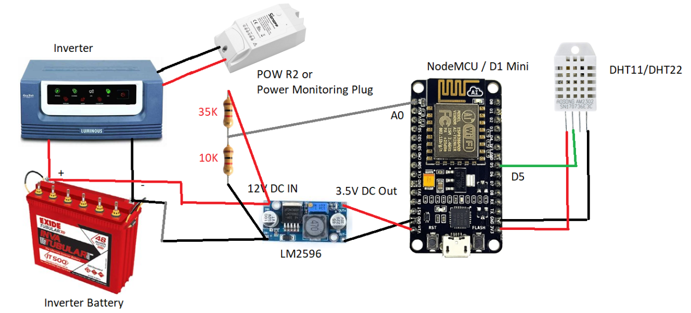
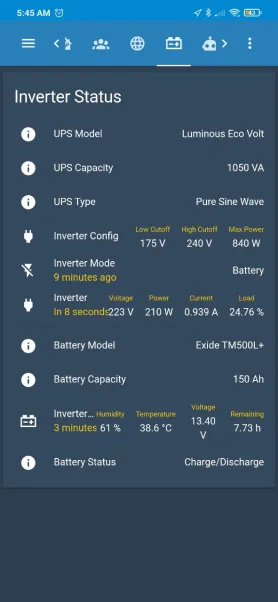

# Inverter Battery Monitor

Monitoring inverter battery for voltage, current and temperature and possible Hydrogen emissions
1) Connect the components per diagram.
2) LM2596 has to be tuned with the help of Multimeter before connecting to NodeMCU/D1 Mini. Default it gives 12VDC to 12VDC or more than that. Adjust the screw on the top by unscrewing it to decrease the output Voltage. Make it sufficient to power NodeMCU/D1 Mini
3) Calculate the required resistor with the help of the site https://www.allaboutcircuits.com/tools/voltage-divider-calculator/. Give your voltage of the Inverter battery (approx from 12.5 v to 14v) and give the resistor values R1 & R2, when you calculate you will get the output voltage for measuring in A0 pin. Make it as 3.5V as NodeMCU/D1 has withstand limited voltage.
4) Connect POW or Similar Power Monitoring Device to calculate the remaining life of battery in case of power failure. Power failure can be detected if the voltage of the battery drops below the normal voltage or if you have a Smart Switch connected to the input of Inverter.
5) Use the attached ESPHOME YAML for flashing on your ESP8266, change the necessary applicable parameters.
6) Use the attached Home Assistant YAML for calculating the Battery remaining time, and load etc. 





```yaml
esphome:
  name: battery_monitor
  platform: ESP8266
  board: nodemcuv2

wifi:
  ssid: XXYYZZ
  password: XXYYZZ
  fast_connect: true
  reboot_timeout: 0s
  manual_ip:
    static_ip: 192.168.1.116  # Required to flash again via OTA
    gateway: 192.168.1.1
    subnet: 255.255.255.0

# Enable logging
logger:
  level: DEBUG

api:
  password: XXYYZZ

ota:
  password: XXYYZZ

sensor:
  - platform: adc
    pin: A0
    name: Battery Voltage
    update_interval: 10s
    filters:
      - calibrate_linear:  # min 2 values required
          - 0.95 -> 13.51 # need to caliberate using Multimeter
          - 0.96 -> 13.52

  - platform: dht
    pin: D0
    temperature:
      name: "Battery Temperature"

    humidity:
      name: "Battery Humidity"
    update_interval: 60s
```

```yaml
- platform: template
  sensors:
    battery_backup_time:
      friendly_name: Battery Backup Time
      unit_of_measurement: 'Hours'
      icon_template: 'mdi:car-battery'
      value_template: >
        
          {{ ( 150 * (states('sensor.battery_voltage')|float) * 1 * 0.8 / states('sensor.inverter_energy_power')| float )| round(2) }}
        
          ~
        

    ups_mode:
      friendly_name: UPS Mode
      icon_template: 'mdi:flash-off'
      value_template: >
        
          Mains
        
          Battery
        

    ups_load:
      friendly_name: UPS Load
      unit_of_measurement: '%'
      icon_template: 'mdi:download'
      value_template: >
        
          {{ ( states('sensor.inverter_energy_power')| float * 100 / (1050 * 0.8) )| round(2) }}
        
          0
        

    battery_status:
      friendly_name: Battery Status
      icon_template: 'mdi:information'
      value_template: >
        
          Fully Charged
        
          About to Die
        
          Charge/Discharge
        
```
