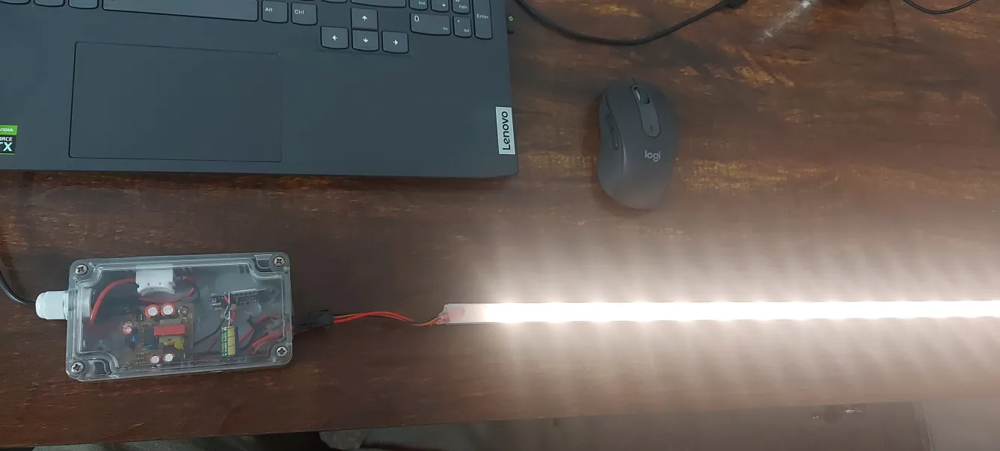
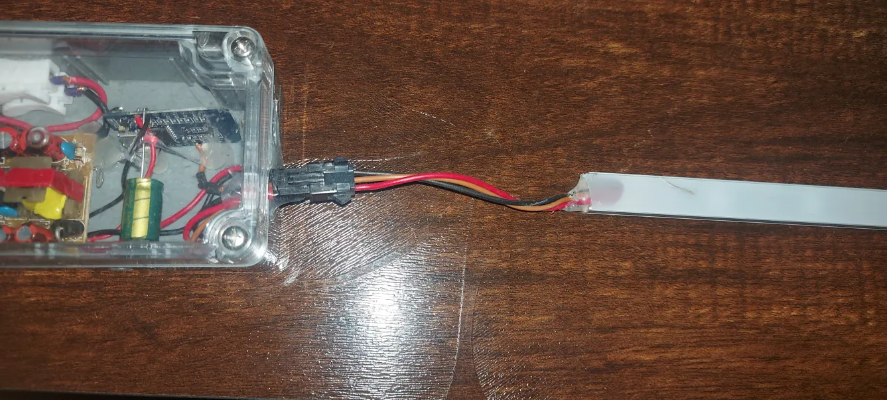
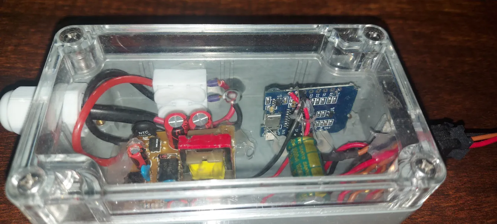
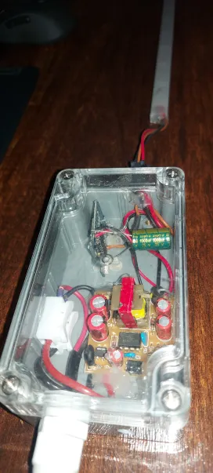
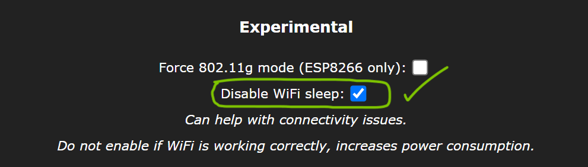

# Quick and easy WLED ambient light for room (HA and Alexa)

Hey Guys made this project in less than an hour, Its pretty easy and every DIY enthu can make it in no time. It gives excellent convenience during night bed time breaks. just say "Alexa turn on ambient light".

## Here are things required

1. WLED strip (2812) 30 per meter (you can go for 60per meter) + aluminum channel (if you have use else use bare strip)
2. WeMo's D1 mini - 160INR (+1000uF capacitor)
3. 230V to 5V 2A smps - 60 - 80INR
4. power cord - 20INR
5. old enclosure
6. glue gun, soldering, short wires and little patience working on computer

## HW

- 5V DC output from SMPS to following  
    1) LED strip + and -
    2) WeMo's D1 Mini +5V and - (1000uF capacitor solder to 3.3V and GND of Wemos)
- LED strip Data pin connect to D5 (i did not connect any resistor in series between 8266 and Wled)
- prepare software (SW) follow below SW para (connect microusb for flashing)
- put all of them in one enclosure and power up

## SW

- Download WLED firmware by following steps mentioned in the following link (https://kno.wled.ge/basics/install-binary/) + configure nb of LEDs, current, wifi credentials etc as mentioned in the page
- and in wifi settings of WLED UI page, as shown in image check the box (in my case i've unchecked in the beginning and i've seen frequent freezes of ESP8266) after checking all are ok. rarely the ESP8266 restarts on its own)

## in HA

- click here it will land in HA "https://my.home-assistant.io/redirect/config_flow_start?domain=wled"
- it should be able to auto configure your HW 

## for Alexa

in HA -> configuration.yaml -> add following

```yaml
emulated_hue:
  type: alexa
  host_ip: 192.168.1.4** (mention home assistant server IP address)**
  listen_port: 80
  expose_by_default: false #true will expose all
    light.wled:
      name: "ambient light"
      hidden: false
```

Thats it. ask "alexa to explore devices"; once done ask Alexa to turn on ambient light 🙂

## Resources

- https://kno.wled.ge/basics/top5_mistakes/

  





