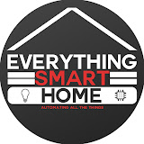
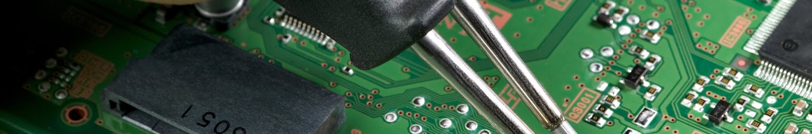
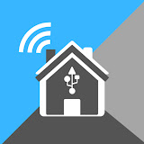
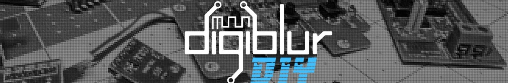
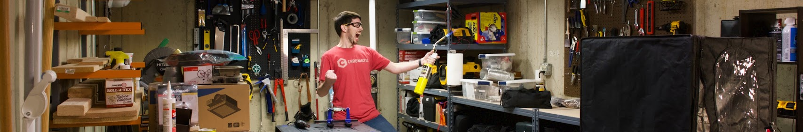
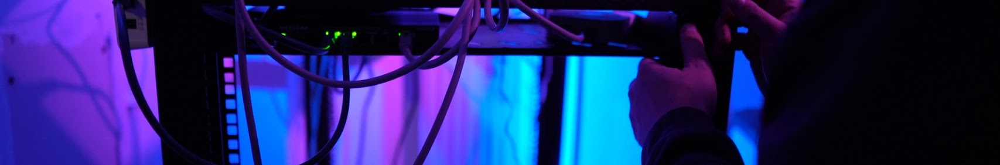

We’ve curated a selection of YouTube channels that offer invaluable insights and guidance on home automation and home lab setups. Whether you’re a DIY enthusiast or a tech-savvy individual looking to enhance your smart home experience, these channels provide a wealth of knowledge and practical tips. Please note that the channels listed here are not ranked in any particular order of priority; each offers unique perspectives and expertise to help you achieve your home automation goals. Explore these resources to find the support and inspiration you need for your projects!

## Home Automation

| Profile Pic    | YouTube URL | YouTube Banner |
| -------- | ------- | ---- |
|  | [@EverythingSmartHome](https://www.youtube.com/@EverythingSmartHome) |      |
|  | [@SmartHomeSolver](https://www.youtube.com/@SmartHomeSolver) |     |
|  | [@SmartHomeJunkie](https://www.youtube.com/@SmartHomeJunkie) |  |
|  | [@HomeAutomationGuy](https://www.youtube.com/@HomeAutomationGuy) |  |
|  | [@TheHookUp](https://www.youtube.com/@TheHookUp) |  |
|  | [@paulhibbert](https://www.youtube.com/@paulhibbert) |  |
|  | [@makeitworktech](https://www.youtube.com/@makeitworktech) |  |
|  | [@ChrisMaherDIY](https://www.youtube.com/@ChrisMaherDIY) |  |
|  | [@AndreasSpiess](https://www.youtube.com/@AndreasSpiess) |  |
|  | [@the_vccground](https://www.youtube.com/@the_vccground) |  |
|  | [@MarkWattTech](https://www.youtube.com/@MarkWattTech) |  |
|  | [@digiblurDIY](https://www.youtube.com/@digiblurDIY) |  |
|  | [@DIYMachines](https://www.youtube.com/@DIYMachines) |  |
|  | [@HomeSight](https://www.youtube.com/@HomeSight) |  |

## Home Lab

| Profile Pic    | YouTube URL | YouTube Banner |
| -------- | ------- | ---- |
|  | [@TechnoTim](https://www.youtube.com/@TechnoTim) |     |
|  | [@JeffGeerling](https://www.youtube.com/@JeffGeerling) |  |
|  | [@christianlempa](https://www.youtube.com/@christianlempa) |  |
|  | [@Jims-Garage](https://www.youtube.com/@Jims-Garage) |  |
